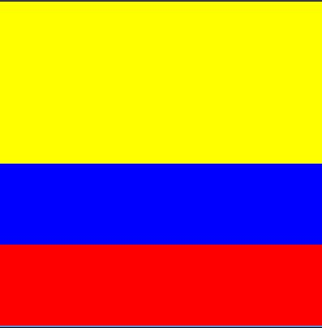

# intro_pygame

## inicializacion


- como en todo programa en pyton, se debe importar los moduloso liberias a utilizar
 import pygame


 - Inicializar pygame usando la funcion init (). Inicializada todos los modulos de pygame importados,
 `pygame.init()`

## visualizacion de la ventana

`ventana = pygame.display.set_mode((600,400))`

- set mode() es la funcion encargada de definir el tamaño de la ventana.en el ejemplo se esta definiendo una ventana 600 de ancho por 400 de alto 


`pygame.display.set_caption("mi ventana")`

- set_carption()es la funcion que añade un titulo a la ventana.

### funcion sat_mode()

`set_mode(size=(0,0),flags =8,depth =0, display = 0)`

- flags: define uno o mas comportamientos para la ventana.
    -valores:
    -pygame.fullscreen
    -pygame.resizable
 -ejemplo:
    -flags= pygame.fullscreen | pygame.
    resizable:pantalla completa,
    dimensiones modificables,

 ## Bucle del juego -game lonp
 - Bucle infinito que se interrumpira al cumplir ciertos criterios.
 - reloj interno del juego
 - en cada internacion del bucle del juego podemos mover a un personaje, o tener en cuenta que  un objeto a alcanzado a otro, o que se ha cruzado la linea de llegada,lo que quiere decir  que la partida ha terminado.
 - cada interacion es una oportunidad  para actualizar todos los datos relacionados con el estado actual de la partida.
 - en cada internacion se realiza las siguientes tareas:
   1. comprobar que no se alcanzan las condiciones  de parada,en cuyo caso se interrumpe el bucle.
   2. actualizar los recursos nesesarios para la internacion actual,
   3. obtener las entradas del sistema, o de internaccion con el jugador 
   4. actualizar todas las entidades que caraterizan el juego.
   5. refrescar la pantalla.

## superficies pygame 
- superficie:
  - elemento geometrico.
  - linea poligono,imagen,texto que se muestra en la pantalla.
  - poligono se puede o no rellenar de color
  - las superficies se crean de diferente manera dependiendo del tipo:
  - imagen image.load()
  - texo: font.render()
  - superficie: generica: surface()
  - ventana del juego: pygamen.display.set_mode()
  ## la bandera de colombia
 ```Python
  # importamos la libreria pygame

import pygame
import random

rojo = random.randint(0,255)
azul = random.randint(0,255) 
verde= random.randint(0,255)


# inicializamos los modulos de pygame

pygame.init()

# establecer titulo a la ventana 

pygame.display.set_caption("superface")

# establescamos las dimenciones de la ventana 
ventana =pygame.display.set_mode((400,400))

# definimos un color 

#creamos  una superficie
color_aleatorio_superficie=pygame.Surface((400,400))


# rellenos la sueperficie azul
color_aleatorio_superficie.fill(azul)


# inserto o muevo la superficie en la ventana 
ventana.blit(color_aleatorio_superficie,(100,100))


# actualizacion lavisualizacion de la ventana
pygame.display.flip() 

#bucle del juego

while True:
     event=pygame.event.wait()
     if event.type == pygame.QUIT:
       break
     
```



## Gestion del tiempo y los eventos

## modulo tine

- ofrece varias funciones que permiten cronometar la sesion actual (desde el inif()) o pausar,la ejecucion por ejemplo,
- funciones:
-pygame.lime.git_ticks
- pygame.rime.waitpygame.time.delay

- objeto clock
  - la funcion tick permite actualizar el reloj asociado con el juego actual,
  - se llama cada vez que se actualiza la pantalla del juego.
  - permite especificar el numero maximo de fotogramas que se mestran por segundo,y por velocidad de ejecucion del juego.
  - si insertamos en bucle de juego la siguiente linea,garantizamos que nunca se ira mas rapido de 50 fotogramas por segundo:`clock.tick(50)`

  ### Gestion de eventos
- hay diferentes formas para que el progrma sepa que se ha desencadenado un evento,
- es esencial que los programas puedan conocer inmediatamente las acciones del jugador a traves del teclado,mouse, un joystick o cualquier otro periferico.

#### funcion pygame.event.get
- permite obtener todos los eventos en espera de ser procesados y que estan disponibles en una cola
- si no hay ningun,se obtiene una coleccion vacia.
```python
# usamos un bucle para recorrer todos los eventos de la coleccion obtenida al llamar a la funcion 
for eventin pygame.vent.get():
  if event.type == pygame.KEYDOWM:
    PARAR_JUEGO = True
```    
#### funcion pygame.event.wait
- esta funcion espera a que ocurra y en cuanto sucede esta disponible.

```python
while True:
     event=pygame.event.wait()
     if event.type == pygame.QUIT:
       break
```

#### funcion pygame.event.poll
- devuelve solo uno de los eventos que estan en la cola de espera

## sonidos en pygame
- pygame.mixer: modulo que permite la gestion del sonido.
-music.submodulo:que gestiona la musica de fondo.nesesariamente solo hay uno a la vez,
- sound.objeto:de mixer que se puede instanciar varias veces para usarlo en efectos de sonido del juego

### archivos de sonido
- se recomienda usar dos formatos,principales:
- formato wav (naveform audio faile forrat)
- formato abierto y gratuito dgg

### chanel (canal)en pygame
- un juego tiene varios canales de sonido
- se puede asignar un sonido al canal numero 1 y otro diferente al canal numero 2,
- entonces es posible reproducir sonidos simultaneamente activando la lectura en diferentes canales 
## sprites
- objeto que asocia una ubicació, una representación gráfica (esta o aquela imagen, porejemplo) y un conjunto de propiedades.
- estas propiedades pueden ser un nombre, un texto, valores booleanos que caracterizan el objeto en cuestión (por ejemplo si el objeto se puede mover o no)
- una posible traducción del termino sprite podría ser "imagen/objeto" que se actualiza con cada iteración del bucle del juego.
-cuanto mas complejo es el juego, mas objetos gráficos tiene que gestionar y actualizar, lo que puede ser tedioso.
- pygame usa no solo la noción de sprite, sino la noción de grupo de sprites (group)
- la noción de group permite agrupar los objetos del mismo tipo. ejemplo: Todos los soldados de un ejercito, lo que se entiende como una solución de instancias de una clase Soldado.
- un determinado procesamiento se puede aplicar a un conjunto o subconjunto de sprites.  EJEMPLO: xambiar el color de todos los enemigos o hacerinvisibles algunos objetos.